# Contract Scanner


**Copyright (c) 2025 Marco De Roni. All rights reserved.**  
Licensed under the [MIT License](LICENSE).

---

## Overview

Contract Scanner is a Python tool for automated legal contract review.  
It reads PDF and DOCX contracts, extracts key metadata, flags missing clauses,  
and scores clause language as 🔴 Red / 🟡 Yellow / 🟢 Green based on a  
customisable playbook defined in YAML.

Built by a Senior Commercial Legal Counsel with EMEA experience in SaaS  
enterprise contracting, GDPR compliance, and risk assessment.

---

## Features

- 📄 **Multi-format support** — reads PDF and DOCX contracts
- 🔍 **Metadata extraction** — parties, effective date, governing law,  
  jurisdiction, notice period, duration, auto-renewal
- ⚠️ **Missing clause detection** — flags required clauses not found  
  (e.g. Limitation of Liability, GDPR/DPA, Termination)
- 🔴🟡🟢 **Risk scoring** — pattern-based Red/Yellow/Green assessment  
  per clause category
- 📝 **Word report output** — professional `.docx` report with  
  color-coded findings and metadata table
- ⚙️ **Fully customisable playbook** — define your own rules in YAML,  
  no code changes needed
  - 🔒 **PII sanitization** — automatically redacts names, dates, emails and sensitive entities before analysis, then restores them in the final report
  - 🌐 **Streamlit web app** — browser interface, no command line required
- 📋 **Audit log** — append-only JSONL log with SHA256 integrity hash
- 🔒 **PII redaction report** — entities redacted before analysis, restored in report
- 🎯 **Confidence score** — HIGH/MEDIUM/LOW rating per risk finding
- 📄 **Clause extraction** — extracts exact clause text for each finding

---

## Project Structure
```
contract-scanner/
├── config/
│   ├── rules.example.yaml   # Template playbook — copy and customise
│   └── rules.yaml           # Your playbook (excluded from git)
├── contracts/               # Drop your PDF/DOCX files here (excluded from git)
├── output/                  # Generated Word reports (excluded from git)
├── scanner/
│   ├── extractor.py         # PDF and DOCX text extraction
│   ├── metadata.py          # Metadata extraction + rules loader
│   ├── analyzer.py          # Clause analysis and R/Y/G scoring
│   └── reporter.py          # Word report generation
├── main.py                  # Entry point
├── requirements.txt         # Python dependencies
├── LICENSE                  # MIT License
└── README.md
```

---

## Getting Started

### 1. Clone the repository
```bash
git clone https://github.com/YOUR_USERNAME/contract-scanner.git
cd contract-scanner
```

### 2. Create and activate virtual environment
```bash
python3 -m venv venv
source venv/bin/activate        # Mac/Linux
venv\Scripts\activate           # Windows
```

### 3. Install dependencies
```bash
pip install -r requirements.txt
```

### 4. Set up your playbook
```bash
cp config/rules.example.yaml config/rules.yaml
```

Edit `config/rules.yaml` to define your own clause requirements and  
risk scoring rules. The file is excluded from git — your playbook  
stays private.

### 5. Add contracts

Drop one or more `.pdf` or `.docx` files into the `contracts/` folder.  
The folder is excluded from git — your documents never leave your machine.  
You can analyse multiple contracts in one run — the tool will process all  
files found in the folder and generate one Word report per contract.

### 6. Run
```bash
python3 main.py
```

Reports are saved in `output/` as `.docx` files.

---

## Customising the Playbook

The `rules.yaml` file controls everything. No code changes needed.
```yaml
# Required clauses — flagged if not found in the contract
required_clauses:
  - name: "Limitation of Liability"
    keywords: ["limitation of liability", "liability cap"]

# Risk scoring rules per clause category
risk_rules:
  limitation_of_liability:
    - pattern: "unlimited liability"
      score: RED
      comment: "Unlimited liability — unacceptable, must negotiate cap"
    - pattern: "fees paid in the"
      score: GREEN
      comment: "Cap tied to fees paid — market standard for SaaS"
```

Scores:
- 🔴 **RED** — unacceptable language, immediate action required
- 🟡 **YELLOW** — clause present but needs negotiation
- 🟢 **GREEN** — acceptable, market standard

---

## Example Output
```
=== Contract Scanner | 2 file trovati ===

📄 Scanning: MSA_VendorX.pdf
   → 87 sezioni rilevate
   → Estrazione metadati...
   → Analisi clausole...
   → Generazione report Word...

🔴 MSA_VendorX.pdf
   Overall:  RED
   Missing:  Data Protection / GDPR
   Law:      England and Wales
   Date:     1 January 2024
   Notice:   30 days
   Report:   output/report_MSA_VendorX.pdf.docx
```

---

## Privacy & Confidentiality

- `contracts/` is excluded from git — your documents never leave your machine
- `config/rules.yaml` is excluded from git — your playbook stays private
- All processing is local — no data is sent to external APIs
- PII redaction via Microsoft Presidio — sensitive entities anonymised before leaving your machine

---

## Requirements

- Python 3.9+
- pdfplumber
- python-docx
- pyyaml
- colorama

---

## Author

**Marco De Roni**  
Senior Commercial Legal Counsel | EMEA  
[LinkedIn](https://www.linkedin.com/in/marcoderoni/) · [GitHub](https://github.com/marcoderoni)

---

## Demo



---

## License

MIT License — see [LICENSE](LICENSE) for details.